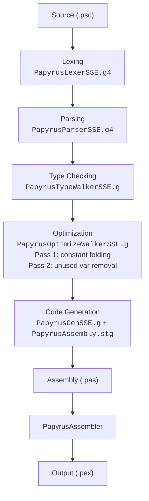
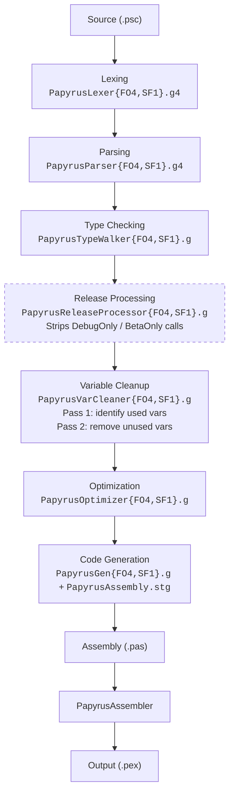

# Open Papyrus

ANTLR grammar files for the Papyrus scripting language used by Bethesda's Creation Engine games.

Papyrus is the scripting language behind Skyrim, Fallout 4, and Starfield. These grammars were reverse engineered from the decompiled C# compilers and document the full compilation pipeline from lexing through code generation.

## Supported Games

| Abbreviation | Game |
|---|---|
| SSE | The Elder Scrolls V: Skyrim & Special Edition |
| FO4 | Fallout 4 |
| SF1 | Starfield |

## Grammar Files

This project contains 21 grammar files covering every stage of the Papyrus compilation pipeline for all three games.

### ANTLR4 Grammars (`.g4`) — Compilable

These grammars can be compiled with ANTLR4 to generate working parsers.

| File | Purpose |
|---|---|
| `PapyrusLexerSSE.g4` | SSE tokenization (62 tokens) |
| `PapyrusLexerFO4.g4` | FO4 tokenization (77 tokens) |
| `PapyrusLexerSF1.g4` | SF1 tokenization (89 tokens) |
| `PapyrusParserSSE.g4` | SSE syntax parsing |
| `PapyrusParserFO4.g4` | FO4 syntax parsing |
| `PapyrusParserSF1.g4` | SF1 syntax parsing |
| `FlagsLexer.g4` | Flag definition file (`.flg`) tokenization — universal across all games |
| `FlagsParser.g4` | Flag definition file (`.flg`) parsing — universal across all games |

### ANTLR3 Documentation Grammars (`.g`) — Reference Only

These grammars document the ANTLR3 tree walker implementations found in the decompiled compilers. They use ANTLR3 tree grammar syntax and are **not compilable** with ANTLR4. They serve as structured, readable documentation of compiler internals that would otherwise only exist as decompiled C#.

| File | Purpose |
|---|---|
| `PapyrusTypeWalkerSSE.g` | SSE type checking and semantic analysis (45 rules) |
| `PapyrusTypeWalkerFO4.g` | FO4 type checking with namespace/struct validation (50 rules) |
| `PapyrusTypeWalkerSF1.g` | SF1 type checking with concurrency validation (55 rules) |
| `PapyrusReleaseProcessorFO4.g` | FO4 release/final build processing — strips `DebugOnly`/`BetaOnly` calls |
| `PapyrusReleaseProcessorSF1.g` | SF1 release/final build processing — strips `DebugOnly`/`BetaOnly` calls |
| `PapyrusVarCleanerFO4.g` | FO4 unused variable removal (2-pass: SCAN then CLEANUP) |
| `PapyrusVarCleanerSF1.g` | SF1 unused variable removal (2-pass: SCAN then CLEANUP) |
| `PapyrusOptimizeWalkerSSE.g` | SSE optimization with integrated variable cleanup (46 rules, NORMAL + VARCLEANUP passes) |
| `PapyrusOptimizerFO4.g` | FO4 optimization passes (14 sub-passes) |
| `PapyrusOptimizerSF1.g` | SF1 optimization passes (14 sub-passes) |
| `PapyrusGenSSE.g` | SSE code generation via StringTemplate (46 rules) |
| `PapyrusGenFO4.g` | FO4 code generation via StringTemplate (52 rules) |
| `PapyrusGenSF1.g` | SF1 code generation via StringTemplate (60 rules) |

## Compilation Pipeline

The pipeline differs between SSE and FO4/SF1. SSE has no `-release`/`-final` flag and integrates variable cleanup into its optimizer. FO4 and SF1 have dedicated release processing and variable cleanup passes between type checking and optimization.

### SSE



### FO4 / SF1



1. **Lexing** — Tokenizes source files into keywords, identifiers, literals, and operators.
2. **Parsing** — Builds an abstract syntax tree (AST) from the token stream.
3. **Type Checking** — Walks the AST to validate types, insert auto-casts, resolve namespaces, and check function signatures.
4. **Release Processing** *(FO4/SF1 only, conditional)* — Strips calls to functions flagged `DebugOnly` (under `-release`) or `BetaOnly` (under `-final`). Replaced call nodes are left as bare return-variable identifiers for cleanup.
5. **Variable Cleanup** *(FO4/SF1 only)* — Removes unused local variable definitions in two passes: SCAN identifies referenced variables, CLEANUP removes unreferenced ones. In SSE this step is integrated into the optimizer's VARCLEANUP pass.
6. **Optimization** — Performs constant folding, short-circuit evaluation, expression simplification, compile-time cast/IS evaluation, and array size validation.
7. **Code Generation** — Walks the AST and uses `PapyrusAssembly.stg` (StringTemplate group) to emit intermediate Papyrus assembly (`.pas`), including temporary variable allocation and name mangling.
8. **Assembly** — `PapyrusAssembler` converts the intermediate assembly into final `.pex` bytecode.

## Key Differences Between Games

| Feature | SSE | FO4 | SF1 |
|---|---|---|---|
| Namespaced Types (`ID:ID`) | No | Yes | Yes |
| Custom Events | No | Yes | Yes |
| Property Groups | No | Yes | Yes |
| Struct Blocks | No | Yes | Yes |
| Guard Definitions | No | No | Yes |
| Lock Guard Statements | No | No | Yes |
| Access Modifiers | No | No | Yes |
| User Flags | ID tokens | 7 keywords | 13 keywords + ID |
| Definition Types | 6 | 9 | 10 |
| Statement Types | 11 | 11 | 13 |

Each game's grammar is a superset of the previous: SSE is the base, FO4 adds structured types and namespaces, and SF1 extends FO4 with concurrency and access control.

## Usage

### Generating Parsers with ANTLR4

The `.g4` grammars can be compiled with ANTLR4 to generate parsers in any supported target language.

```bash
# Generate C# parser for SSE
antlr4 -Dlanguage=CSharp -package OpenPapyrus.SSE -o Generated/SSE PapyrusLexerSSE.g4 PapyrusParserSSE.g4

# Generate C# parser for FO4
antlr4 -Dlanguage=CSharp -package OpenPapyrus.FO4 -o Generated/FO4 PapyrusLexerFO4.g4 PapyrusParserFO4.g4

# Generate C# parser for SF1
antlr4 -Dlanguage=CSharp -package OpenPapyrus.SF1 -o Generated/SF1 PapyrusLexerSF1.g4 PapyrusParserSF1.g4

# Generate flag file parser (same grammar for all games)
antlr4 -Dlanguage=CSharp -package OpenPapyrus.Flags -o Generated/Flags FlagsLexer.g4 FlagsParser.g4
```

Other target languages (Java, Python, TypeScript, etc.) are supported by changing the `-Dlanguage` argument.

## Testing

To validate grammars against real scripts, parse corpora of decompiled Papyrus source files (`.psc`) using the generated parsers. Large script collections can be obtained from each game or Creation Kit.

A passing grammar should parse all vanilla game scripts with zero syntax errors.

## ANTLR Version Note

This project uses two ANTLR grammar formats:

- **`.g4` files** use ANTLR4 syntax and are fully compilable. Use these to generate parsers.
- **`.g` files** use ANTLR3 tree grammar syntax and are documentation only. They describe compiler phases that operate on ASTs using ANTLR3's tree walker mechanism, which has no equivalent in ANTLR4. These grammars exist to document compiler behavior that would otherwise only be accessible as decompiled C# source.
